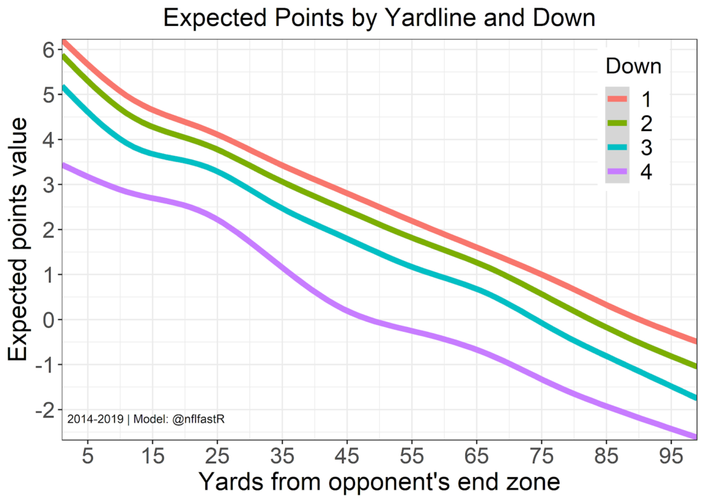

# brock-purdy-mid-course-project
# Evaluating Brock Purdy’s True Skill


# Introduction
Brock Purdy’s rapid rise from the final pick of the 2022 NFL Draft to leading the 49ers to deep playoff runs in his first two seasons was nothing short of remarkable. However, after a challenging 2024 season marked by injuries to key teammates and a decline in performance, questions arise about how much of his success is due to his individual talent versus the strength of the elite system around him.


# Motivation
Brock Purdy has had an impressive start to his NFL career with the San Francisco 49ers. Selected very last in the 2022 NFL draft, Purdy had the opportunity to start for the 49ers his rookie year when their veteran quarterback Jimmy Garoppolo and first round pick Trey Lance both became injured. Purdy shot off to an impressive 5-0 in his first five games as a starter, and his success continued as Purdy brought the 49ers to the NFC championship in 2022, where he was forced off the field with an elbow injury and the 49ers ended up losing to the Philadelphia Eagles. The following season (2023) was just as impressive for Purdy, taking the 49ers all the way to the Super Bowl where San Fransisco lost to the Kansas City Chiefs by 3 points in overtime. Purdy’s first two seasons are undeniably impressive. However, the 2024 season proved challenging for Purdy, as his completion percentage, passer rating, and TD-INT ratio all declined amidst a year marked by injuries to key offensive players, most notably running back Christian McCaffrey. The 49ers ended their 2024 season with Purdy’s worst record yet, finishing 6-11.

Purdy’s early success followed by a decline raises critical questions: *To what extent is his performance a reflection of his own skill versus the strength of the team around him?* Purdy benefits from an elite supporting cast, each playing a crucial role in his success:

* **Trent Williams – Left Tackle (LT)**: The anchor of the offensive line, responsible for protecting Purdy’s blindside and giving him the time needed to make accurate throws.

* **George Kittle – Tight End (TE)**: A versatile player who excels in both blocking and receiving, providing a reliable target for short and intermediate passes while also contributing to pass protection.

* **Deebo Samuel & Brandon Aiyuk – Wide Receivers (WR)**: Dynamic playmakers who create separation, make tough catches, and extend plays after the catch, giving Purdy multiple downfield threats.

* **Christian McCaffrey – Running Back (RB)**: A dual-threat weapon who not only excels in rushing but also serves as a dependable receiving option, easing pressure on Purdy by keeping defenses off balance.

Purdy is further supported by his head coach, Kyle Shanahan, who is known for his elite offensive schemes. 

The 49ers have made it clear they intend to significantly increase their quarterback’s compensation this offseason, raising his current average salary of $934,252 to $50 million or more. This would place Purdy among the highest-paid quarterbacks in the NFL, but does his skill really justify such a contract?

# Key Analysis Components
Metrics for measuring quarterback skill:

> ## 1. Expected Points Added (EPA)
>
> 
>
> Expected Points Added (EPA) per play is a metric that quantifies the impact of each play on a team’s likelihood of scoring. The values for Expected Points (see figure above) were taken from historical data by calculating the average number of points scored by the possessing team according to each down and field position. EPA per play is simply the difference in Expected Points before and after a play. Instead of just measuring yardage, EPA accounts for game context, such as downs, distance to a first down, and field position, to determine how much a play increases or decreases a team’s expected points. For example, a 5-yard gain on a third-and-4 is much more valuable than a 5-yard gain on a third-and-10, as it results in a first down and extends the drive. EPA is an effective metric for measuring quarterback skill because it captures a quarterback’s ability to make plays that meaningfully contribute to scoring.
>
> [Learn More](https://bestballstats.com/expected-points-added-a-full-explanation/)

> ## 2. Adjusted Net Yards per Attempt (ANY/A)
>
> $$
> \text{ANY/A} = \frac{\text{Pass Yards} + 20 \times (\text{Pass TD}) - 45 \times (\text{Interceptions Thrown}) - \text{Sack Yards}}{\text{Passing Attempts} + \text{Sacks}}
> $$
>
> Adjusted Net Yards per Attempt (ANY/A) is an advanced passing efficiency metric that improves on traditional yards per attempt by incorporating touchdowns, interceptions, and sacks, thus providing a more comprehensive measure of a quarterback’s effectiveness in the passing game. ANY/A can be a valuable tool for comparing performance across different players and seasons.
>
> [Learn More](https://www.advancedfootballanalytics.com/2013/10/introducing-anya-differential.html)

> ## 3. Passer Rating
>
> $$
> \begin{aligned}
>     a &= \left(\frac{\text{Comp}}{\text{Att}} - 0.3\right) \times 5 \\
>     b &= \left(\frac{\text{Yds}}{\text{Att}} - 3\right) \times 0.25 \\
>     c &= \frac{\text{TD}}{\text{Att}} \times 20 \\
>     d &= 2.375 - \left(\frac{\text{INT}}{\text{Att}} \times 25\right) \\
>     \text{Passer Rating} &= \frac{a + b + c + d}{6} \times 100
> \end{aligned}
> $$
>
> $$
> \text{Note: Each component (a, b, c, d) must be between 0 and 2.375.}
> $$
>
> Passer rating is calculated based on completions, passing yards, touchdowns, and interceptions per attempt, generating a score between 0 and 158.3 that is designed to summarize a quarterback’s effectiveness. A higher score indicates better performance. While passer rating is useful for comparing QBs within a season, it has limitations as it does not account for sacks, rushing ability, or game context.

Combining ANY/A, EPA, and Passer Rating provides a well-rounded approach to evaluating quarterback performance, capturing efficiency (ANY/A), impact on scoring (EPA), and traditional passing effectiveness (Passer Rating).

# Regression Models
To better understand the relationship between various quarterback metrics, regression models were used to predict **ANY/A, EPA, and Passer Rating** based on key variables:

```r
create_dependent_var_model <- function (dependent_var) {
  lm(as.formula(glue("{dependent_var} ~ yards_after_catch + percent_pass_yds_from_yac + sacks_per_dropback + short_pass + percent_short_pass + total_rush_yds")), data = qb_clean)
}

anya_model <- create_dependent_var_model('any_a')
epa_model <- create_dependent_var_model('qb_epa')
pr_model <- create_dependent_var_model('passer_rating')

qb_clean <- qb_clean |> 
  mutate(predicted_anya = predict(anya_model, newdata = qb_clean),
         predicted_epa = predict(epa_model, newdata = qb_clean),
         predicted_passer_rating = predict(pr_model, newdata = qb_clean)
  )
```

The variables used in the model include:
- **Yards After Catch (YAC)** and **Percentage of Passing Yards from YAC** to account for receiver contributions.
- **Sacks per Dropback** to assess pressure and offensive line performance.
- **Short Pass Attempts** and **Percentage of Short Passes** to evaluate passing style.
- **Total Rushing Yards** to measure offensive balance (run or pass heavy?).

Each variable in the models was found to be statistically significant with **p-values less than 0.05**, indicating significant predictive power in evaluating quarterback metrics.

# Data Sources
To ensure a robust and accurate analysis, we utilized high-quality data from the following sources:

- **nflfastR**: The primary source for **play-by-play data**, which includes detailed game-level events such as passing, rushing, and defensive plays. This dataset is widely used for advanced NFL analytics. The data can be accessed via GitHub: [nflfastR Repository](https://github.com/nflverse/nflfastR).
- **Pro Football Reference**: Used for **coaching data**, to assign head coaches to each team per season. If multiple coaches led a team in a given year, the coach with the most games coached was assigned as that season’s head coach. Coaching data can be retrieved via [Pro Football Reference](https://www.pro-football-reference.com/) and processed using `retrieving_coaching_data.ipynb`.
- **Quarterback Salary Data**: The salary data for quarterbackswas integrated into the analysis to compare performance versus compensation. Salary data was sourced from [Over The Cap](https://overthecap.com/position/quarterback/2024#google_vignette).

  The **top 10 highest-paid quarterbacks in 2024** based on APY are:
  1. **Dak Prescott**
  2. **Joe Burrow**
  3. **Jordan Love**
  4. **Trevor Lawrence**
  5. **Tua Tagovailoa**
  6. **Jared Goff**
  7. **Justin Herbert**
  8. **Lamar Jackson**
  9. **Jalen Hurts**
  10. **Kyler Murray**


# Data Considerations
When preparing and analyzing the dataset, the following considerations were made:

- **Team Naming Conventions**: All teams are referenced using their **current franchise names** (e.g., the Oakland Raiders are listed as the **Las Vegas Raiders**).
- **Quarterback Selection Criteria**: Only quarterbacks who attempted **more than 10 passes in a game** were included in the analysis to ensure meaningful sample sizes.
- **Coach Assignment**: Head coaches were assigned based on **team and year**, ensuring that the individual who coached the most games in a season was credited as that year’s coach.
